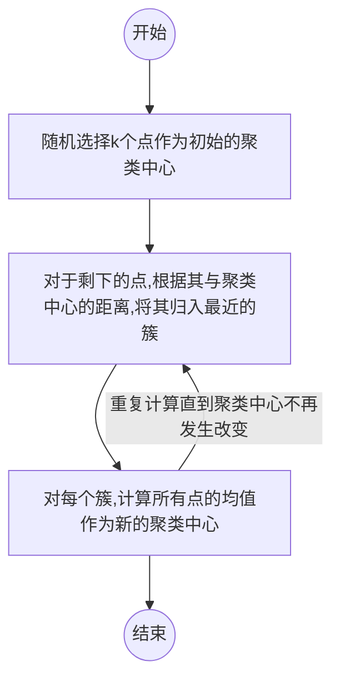
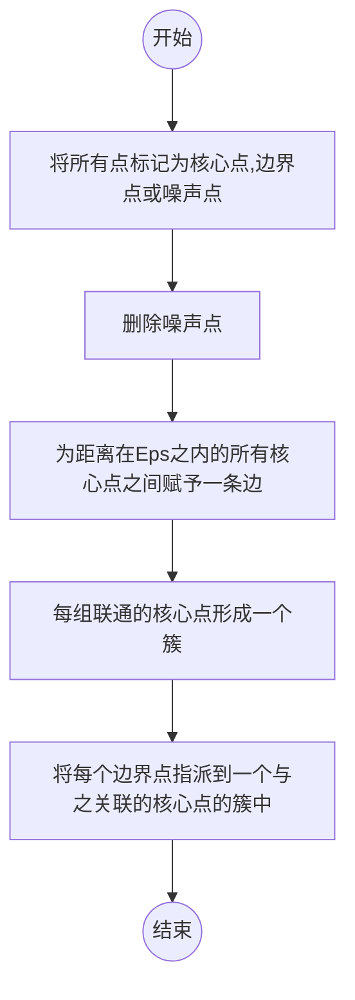

[toc]

# 1 机器学习简介

## 1.1 机器学习分类

- 监督学习（Supervised Learning）
- 无监督学习（Unsupervised Learning）
- 强化学习(Reinforcement Learning)
- 半监督学习（Semi-supervised Learning）
- 深度学习(Deep Learning)

## 1.2 Python sk-learn

- 一组简单有效的工具集
- 依赖Python的Numpy、SciPy和matplotlib
- 开源

## 1.3 sk-learn常用函数

| 类型                    | 应用               | 算法          |
| ----------------------- | ------------------ | ------------- |
| 分类Classification      | 异常检测，图形识别 | KNN,SVN       |
| 聚类Clustering          | 图形分割，群体划分 | K-Mean,谱聚类 |
| 回归Regression          | 价格预测，趋势预测 | 线性回归，SVR |
| 降维Dimension Reduction | 可视化             | PCA，NMF      |

## 1.4 学习目标

- 了解基本的机器学习原理和算法
- 学习利用机器学习算法解决应用问题的能力
- 掌握sklearn库中常用的机器学习算法的基本调用方法

# 2 sk-learn库

安装依赖库Numpy,SciPy,matplotlib

## 2.1 常用数据集

|          | 数据集名称             | 调用方式               | 适用算法   | 数据规模     |
| -------- | ---------------------- | ---------------------- | ---------- | ------------ |
| 小数据集 | 波士顿房价数据集       | load_boston()          | 回归       | 506*13       |
|          | 鸢尾花数据集           | load_iris()            | 分类       | 150*4        |
|          | 糖尿病数据集           | load_diabetes()        | 回归       | 442*10       |
|          | 手写字体数据集         | load_digits()          | 分类       | 5620*64      |
|          | Olivetti脸部图像数据集 | fetch_olivetti_faces() | 降维       | 40064*64     |
|          | 新闻分类数据集         | fetch_20newsgroups()   | 分类       | ---          |
|          | 带标签的人脸数据集     | fetch_lfw_people()     | 分类；降维 | ---          |
|          | 路透社新闻语料数据集   | fetch_rcvl()           | 分类       | 804414*47236 |

* 注：小数据集可以直接使用，大数据集需要在调用时候程序自动下载（一次即可）

## 2.2 波士顿房价数据集

### 2.2.1 简介

包含506组数据，每条包含房屋以及房屋周围的详细信息，其中包括城镇犯罪率、一氧化碳浓度、住宅平均房间数、到中心区域的加权距离以及自住房平均房价等。

### 2.2.2 使用方法

使用sklearn.datasets.load_boston

重要参数：

* return_X_y:表示是否返回target(价格)，默认为False，只返回data(即属性)

```python
from sklearn.datasets import load_boston
boston = load_boston()
print(boston.data.shape)

data,target = load_boston(return_X_y=True)
print(data.shape)
print(target.shape)
```

输出依次为：

```
>(506,13)
>(506,13)
>(503,)
```


## 2.3 鸢尾花数据集

### 2.3.1 简介

测量数据以及所属的类别。

测量数据包括：萼片长度、萼片宽度、花瓣长度、花瓣宽度

类别包括Iris Setosa,Iris Versicolour,Iris Virginica

### 2.3.2 使用方法

使用sklearn.datasets.load_iris

重要参数：

* return_X_y:表示是否返回target(价格)，默认为False，只返回data(即属性)

```python
from sklearn.datasets import load_iris
iris = load_iris()
print(iris.data.shape)

data,target = load_iris(return_X_y=True)
print(data.shape)

print(target.shape)

list(iris.target_names)

```

输出依次为：

```
>(150,4)
>(150,4)
>(150,)
>['setosa', 'versicolor', 'virginica']
```


## 2.4 手写数字数据集

### 2.4.1 简介

包含1797个0-9的手写数据，每个由8*8大小矩阵构成，矩阵范围值是0-16，代表颜色深度

### 2.4.2 使用方法

使用sklearn.datasets.load_digits

重要参数：

* return_X_y:表示是否返回target(价格)，默认为False，只返回data(即属性)

* n_class:返回数据类别数，如n_class=5，则返回0-4的数据样本

  ```
  from sklearn.datasets import load_digits
  digits = load_digits()
  print(digits.data.shape)
  print(digits.target.shape)
  print(digits.images.shape)
  
  import matplotlib.pyplot as plt
  plt.matshow(digits.images[1])
  plt.show()
  ```

  输出依次为

  ```
  >(1797, 64)
  >(1797,)
  >(1797, 8, 8)
  ```



## 2.5 sklearn库基本功能

### 2.5.1 分类任务


### 2.5.2 回归任务


### 2.5.3 聚类任务


### 2.5.4 降维任务


# 3 无监督学习

## 3.1 无监督学习简介

利用无**标签**的数据学习数据的分布或数据与数据之间的关系被称作无监督学习。

## 3.2 聚类Clustering

### 3.2.1 什么是聚类

聚类是根据数据的相似性将数据分为多类的过程。

评估两个不同样本之间的相似性，通常使用的方法就是计算两个样本之间的距离。

### 3.2.2 距离计算方法

#### 3.2.2.1 欧式距离

欧式空间中两点的距离。


#### 3.2.2.2 曼哈顿距离

类似在城市中驾车行驶，从一个十字路口到另一个十字路口的距离。


#### 3.2.2.3 马氏距离

表示数据的协方差距离，是一种尺度无关的度量方式，先将样本点各个属性标准化，再计算样本间的距离。


#### 3.2.2.4 夹角余弦相似度

利用向量空间中两个向量的余弦值作为衡量两个样本差异的大小，余弦值越接近1，说明两个向量夹角越接近0都，表明两个向量越相似。


### 3.2.3 sklearn.cluster算法

| 算法名称          | 参数                     | 可扩展性                       | 相似性度量         |
| ----------------- | ------------------------ | ------------------------------ | ------------------ |
| K-means           | 聚类个数                 | 大规模数据                     | 点间距离           |
| DBSCAN            | 邻域大小                 | 大规模数据                     | 点间距离           |
| Gaussian Mixtures | 聚类个数及其他超参       | 复杂度高，不适合处理大规模数据 | 马氏距离           |
| Birch             | 分支因子，阈值等其他超参 | 大规模数据                     | 两点之间的欧式距离 |

## 3.3 降维Dimension Reduction

### 3.3.1 什么是降维

在爆炸数据所具有的代表性特征或者分布的情况下，将高维数据转化为低维数据的过程。

主要用于：

- 数据的可视化
- 精简数据

### 3.3.2  sklearn.decomposition算法

| 算法名称 | 参数               | 可扩展性     | 适用任务           |
| -------- | ------------------ | ------------ | ------------------ |
| PCA      | 所将维度及其他超参 | 大规模数据   | 信号处理           |
| FasrICA  | 所将维度及其他超参 | 超大规模数据 | 图形图形特征提取   |
| NMF      | 所将维度及其他超参 | 大规模数据   | 图形图形特征提取   |
| LDA      | 所将维度及其他超参 | 大规模数据   | 文本数据，主题挖掘 |

## 3.4 K-means方法及其应用

### 3.4.1 算法原理

以k为参数，把n个对象分成k个簇，使簇内具有较高的相似度，而簇间的相似度较低。具体流程如下。



### 3.4.2 kmeans应用

#### 3.4.2.1 数据介绍

现有1999年全国31个省份城镇居民家庭平均收入全年消费性支出的八个主要变量数据，分为为：食品、衣着、家庭设备用品及服务、医疗保健、交通和通讯、娱乐教育文化服务、居住以及杂项商品和服务。利用已有数据。对31个省份进行聚类。


#### 3.4.2.2 分析目的

了解1999年各个省份的消费水平在国内的情况

#### 3.4.2.3 参数说明

​		**n_clusters**：整型，缺省值=8 ，生成的聚类数。
　　**max_iter**：整型，缺省值=300 。
　　　　执行一次k-means算法所进行的最大迭代数。
　　**n_init**：整型，缺省值=10 。
　　　　　 用不同的聚类中心初始化值运行算法的次数，最终解是在inertia意义下选出的最优结果。
　　**init**：有三个可选值：’k-means++’， ‘random’，或者传递一个ndarray向量。
　　　　 此参数指定初始化方法，默认值为 ‘k-means++’。
　　　　（１）‘k-means++’ 用一种特殊的方法选定初始聚类中心，可加速迭代过程的收敛。
　　　　（２）‘random’ 随机从训练数据中选取初始质心。
　　　　（３）如果传递的是一个ndarray，则应该形如 (n_clusters, n_features) 并给出初始质心。
　　**precompute_distances**：三个可选值，‘auto’，True 或者 False。
　　　　预计算距离，计算速度更快但占用更多内存。
　　　　（１）‘auto’：如果 样本数乘以聚类数大于 12million 的话则不预计算距离。
　　　　（２）True：总是预先计算距离。
　　　　（３）False：永远不预先计算距离。
　　**tol**：float类型，默认值= 1e-4　与inertia结合来确定收敛条件。
　　**n_jobs**：整形数。　指定计算所用的进程数。内部原理是同时进行n_init指定次数的计算。
　　　　（１）若值为 -1，则用所有的CPU进行运算。若值为1，则不进行并行运算。
　　　　（２）若值小于-1，则用到的CPU数为(n_cpus + 1 + n_jobs)。因此如果 n_jobs值为-2，则用到的CPU数为总CPU数减1。
　　**random_state**：整型或 numpy.RandomState 类型，可选
　　　　　用于初始化质心的生成器（generator）。如果值为一个整数，则确定一个seed。此参数默认值为numpy的随机数生成器。
　　**copy_x**：布尔型，默认值=True 

一般调用的时候只用给出n_clusters即可

#### 3.4.2.4 代码实现

```python
# 导入库函数
import numpy as np
from sklearn.cluster import KMeans

# 定义函数 
## 读取数据
def load_data(file_name):
    fr = open(file_name,'r+')
    ## 一次读取整个文件
    lines = fr.readlines()
    ## 存放城市各类消费信息
    ret_data = []
    ## 城市名称
    ret_city_name = []
    
    for line in lines:
        items = line.strip().split(",")
        ret_city_name.append(items[0])
        ret_data.append([ float(items[i]) for i in range(1,len(items))])
            
    return ret_data,ret_city_name


# 加载数据，创建K-means算法实例，并进行训练，获得标签
if __name__ == '__main__':
    # 定义参数
    ## 文件参数
    file_path_input = '..\\02 数据\\聚类\\'
    file_name_input = '31省市居民家庭消费水平-city.txt'
    ## 聚类参数
    #n_cluster_value = 3
    ## 存放聚类数据
    #city_cluster = [[],[],[]]
    
    ## 输入分类
    n_cluster_value = int(input("请确定需要分几类？："))
    city_cluster = []
    for i in range(n_cluster_value):
        city_cluster.append([])
    
    # 载入数据
    data,city_name = load_data(file_path_input+file_name_input)
 
    # 创建kmeans实例
    km_example = KMeans(n_clusters=n_cluster_value)
    
    # 打标签
    label = km_example.fit_predict(data)
    expenses = np.sum(km_example.cluster_centers_,axis=1)
    #p·rint(expenses)
    
    for i in range(len(city_name)):
        #print(city_name[i])
        city_cluster[label[i]].append(city_name[i])
        
    for i in range(len(city_cluster)):
        print("Expenses:%.2f"%expenses[i])
        print(city_cluster[i])
```

#### 3.4.2.5 实现效果


## 3.5 DBSCAN算法

### 3.5.1 算法说明

DBSCAN密度聚类将数据点分为三类

- **核心点**：在半径Eps内含有超过MinPts数目的点
- **边界点**：在半径Eps内点的数量小于MinPts，但是落在核心点的领域内
- **噪音点**：既不是核心点，又不是边界点的点


**算法流程**



### 3.5.2 算法应用

#### 3.5.2.1 数据介绍

现有大学校园网的日志数据，290条大学生的校园网使用情况呼叫，数据包括用户ID，设备的MAC地址，IP地址，开始上网时间，停止上网时间，上网时长，校园网套餐等，利用已有数据，分析学生上网的模式。


#### 3.5.2.2 分析目的

分析学生上网时间和上网时长的模式

#### 3.5.2.3 参数说明

- eps:两个样本被看作邻居节点的最大距离
- min_samples:簇的样本数
- metric:距离计算方式

#### 3.5.2.4 代码实现

```python
# 导入库
from sklearn.cluster import DBSCAN
from sklearn import metrics
import matplotlib.pyplot as plt
import numpy as np

# 定义函数
def read_data(file_name):
    mac2id = dict()
    online_times = []
    ## 读取数据
    fr = open(file_name,'r+',encoding='utf-8')
    lines = fr.readlines()
    ## 构建数据结构
    for line in lines:
        mac = line.split(',')[2]
        online_time = int(line.split(',')[6])
        start_time = int(line.split(',')[4].split(' ')[1].split(':')[0])
        if mac not in mac2id:
            mac2id[mac] = len(online_times)
            online_times.append((start_time,online_time))
        else:
            online_times[mac2id[mac]] = [(start_time,online_time)]
        
    real_X = np.array(online_times).reshape((-1,2))  
    return real_X


# 主模块
if __name__ == '__main__':
    # 定义参数
    ## 文件参数
    file_path_input = '..\\02 数据\\聚类\\'
    file_name_input = '学生月上网时间分布-TestData.txt'
    
    data = read_data(file_path_input+file_name_input)
    
    # 调用DBSCAN算法
    ## 在线小时
    online_hour_num = data[:,0:1]
    ## 创建DBSCAN实例
    db = DBSCAN(eps=0.01,min_samples=20).fit(online_hour_num)
    ## 数据的簇标签
    labels = db.labels_
    
    ## 打印数据被标记的标签，计算标签为-1，即噪声数据的比例
    print('Labels: ')
    print(labels)
    noise_ratio = len(labels[labels[:]==-1]) / len(labels)
    print('Noise ratio:',format(noise_ratio,'.2%'))
    
    ## 计算簇的个数并打印，评价聚类效果
    n_clusters = len(set(labels)) - (1 if -1 in labels else 0)
    print('Estimated number of clusters:%d ' %n_clusters)
    print('Silgouette Coefficient:%0.3f' %metrics.silhouette_score(online_hour_num,labels))
    
    ## 打印各簇标号和各簇数据
    for i in range(n_clusters):
        print('Cluster ',i,':')
        print(list(online_hour_num[labels == i].flatten()))
    
    plt.hist(online_hour_num,24)
```

#### 3.5.2.6 实现效果


上网时间大多聚集在22点和23点

## 3.6 PCA方法及其应用


# 7 进一步学习

1. 周志华，机器学习，清华大学出版社
2. Bishop，PRML,Springer
3. Andrew Ng,Machine Learning,http://cs229.stanford.edu/
4. FeiFei Li,CS231n,http://cs231n.stanford.edu/
5. David Silver,Reinforcement Learninng,http://t.cn/RIAfRUt
6. DBSCAN算法可视化展示https://www.naftaliharris.com/blog/visualizing-dbscan-clustering/